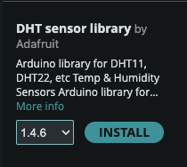
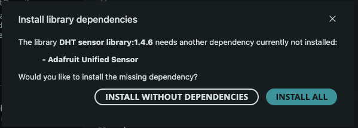

# Plant Watering Starter Project

This project reads in data from a variety of sensors (temperature, humidity, light level, and soil moisture),
and automatically waters a plant when the soil humidity drops below a certain level.  
  
The code in this project is based on the code found [here](https://docs.sunfounder.com/projects/3in1-kit-v2/en/latest/iot_project/iot_plant_monitor.html).

# Setup
1. Assemble the components and wire them together as shown in the diagram [here](https://docs.sunfounder.com/projects/3in1-kit-v2/en/latest/iot_project/iot_plant_monitor.html)
2. Install the `DHT Sensor Library` in Arduino IDE
    1. Click on the library icon in the left sidebar  
    
    2. Search for `DHT Sensor Library` in the search bar  
    
    3. Click install  
    
    4. Click `Install All` (if this window shows up)  
    
3. Flash the code in the `moisture_sensor/` directory
4. Open the serial monitor (in the top right corner) to see the sensor readings!  

